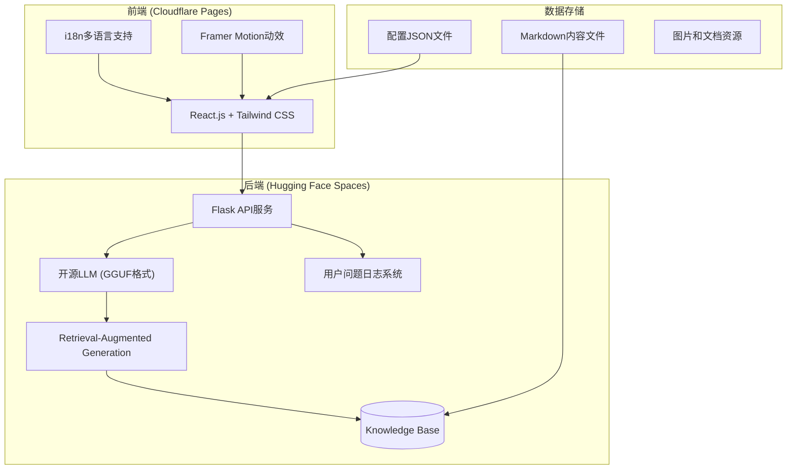

我的问题：
考虑到所有的设计与需求给出优化建议，以及合适的技术栈实现方案。

我粘贴的内容：

```
你是陈佳，想用python做一个给HR和博士生导师看的网站，从而让他们更了解你，看到你身上的潜力。
这个网站的设计核心应该围绕着“潜力、对AI的热情、持续学习能力和独立解决问题的能力”这几个点展开。界面要简洁、专业，突出重点，让访问者在短时间内就能了解我的关键信息。

# 整体设计理念：
简洁大方： 使用干净的布局、专业的配色方案（例如，科技蓝、灰色调搭配少量亮色点缀）。
直观易懂： 关键信息一目了然，使用图标、图表和清晰的标题。
突出重点： 将AI/ML相关的技能、项目和经验放在更突出的位置。
互动性： 通过AI聊天机器人和项目详情页面增加用户参与度。
响应式设计： 确保在不同设备（电脑、手机、平板）上都能良好显示 。

# 多语言切换（中英双语）
	•	考虑为HR和导师提供英文版本，展现你的国际化意识。可在导航栏尾部加入语言切换按钮（EN | 中文）。
	•	技术实现可用i18n库或自己维护一组翻译文件。

# AI代理机器人（聊天机器人）设计：
AI机器人不仅是一个技术展示，更是简历信息的智能问答界面。
这是一个亮点！它直接展示了我的AI应用能力。
•	可以使用卡通头像或简洁头像作为机器人视觉标识，拉近与用户的距离。
•	位置： 可以放在网站的右下角或左下角，作为一个可移动悬浮窗口(最小可以缩小成一个小圆标，放大后也不过是一个小方块，从而在手机界面上也足够美观)。
•	功能： 
	•	聊天机器人界面支持两种模式切换：
	•	“普通模式”：展示预设问题按钮。
	•	“探索模式”：用户自由提问。
	•	预设问题建议动态更新，如“你最近在研究什么AI话题？”、“你是否能远程办公？”、“你在计算机视觉领域有哪些经验？”
基于知识库问答： 后端使用Python加载data文件夹中的文本内容（我的个人信息、项目详情、经验总结等）作为知识库。前端提供输入框让用户提问。
开源大模型： 连接一个开源大模型（例如，通过API或本地部署一个轻量级模型，需要考虑部署成本和复杂性（我的电脑是Mac Pro））来处理用户问题，并根据知识库生成回答。这直接展示了我在LLM应用方面的探索和能力。
预设问题建议动态更新： 在聊天窗口中提供几个预设问题按钮，用户点击即可触发，例如：“介绍一下你在禧玛诺的实习经历”、“你在新加坡国立大学学了哪些AI课程？”、“你什么时候可以到岗？”、“你是否有公开的GitHub项目？”，“你最近在研究什么AI话题？”、“你是否能远程办公？”、“你在计算机视觉领域有哪些经验？”。“你是否能远程办公？”：简历中没有明确说明是否接受远程办公。机器人可以直接回答“简历中未提及此偏好，但您可以直接通过[邮箱/电话]联系我咨询”或者根据陈嘉的实际意愿进行设置。简历中提及了预计毕业时间（2025年11月），这与求职的可用性直接相关。o	“你在计算机视觉领域有哪些经验？”：简历中明确提到了在 Shimano 实习期间“利用计算机视觉检测材料缺陷”。这是机器人可以详细介绍的一个具体经验。
•	优势： 这不仅仅是一个FAQ，而是一个智能交互界面，让HR或导师可以“对话”了解我，非常有记忆点。它直接证明了我的Python技能、对AI技术的理解和应用能力。
记录用户的问题写入到log文件夹下，方便后续维护。

# 主体内容板块设计与内容：

1.	主页/关于我 (Home / About Me):
o	位置： 网站首页最上方或第一屏。
o	内容： 
	一段精炼的个人简介摘要。突出“人工智能工程学硕士”，拥有“扎实的软件工程基础”，以及**“热衷于应用AI/ML技术解决实际问题”**。可以加上“自信、有耐心、注重实践”等个人特质。
“亮点速览”横幅
	•	“制造业领域计算机视觉实习经历”，点击后跳转到实习经历的界面。
	•	“具备独立开发Python全栈应用能力”，点击后跳转到project里的第一个项目。
	•	“NUS人工智能系统硕士”，点击后跳转到eduction里nus的那一块儿。
	重要的链接：GitHub链接（展示代码能力，非常重要）、LinkedIn链接（展示职业网络和更详细经历）。
	可以简要提及期望到岗时间（例如，“可到岗时间：课程于2025年8月完成，预计2025年11月毕业”）。

2.	教育背景 (Education):
o	位置： 首页靠前位置，仅次于“关于我”。
o	内容： 
	新加坡国立大学 系统科学研究所：列出人工智能系统技术硕士 (MTech in AI Systems) 和系统分析研究生文凭 (Graduate Diploma in Systems Analysis)。
	重点突出相关的AI/ML课程：智能推理、模式识别、智能机器人、实用语言处理、机器学习、深度学习，以及机器学习应用开发。
	中北大学 软件学院：列出软件工程本科。提及大数据、数据仓库与挖掘等相关课程，这为后续学习AI/ML打下了数据基础。
	列出获得的荣誉：例如中北大学综合优秀奖学金。
	提及学生工作经历，如担任学生会就业部副部长，组织IT招聘会等，这能体现沟通和组织协调能力。
o	设计： 使用时间轴或清晰的列表格式，每个学历条目下方详细列出相关课程和荣誉/活动。

3.	技能 (Skills):
o	位置： 首页重要位置。
o	内容： 
	分类展示技能。
	核心突出AI/ML相关技能： 
	编程语言：Python（重中之重，因为网站用Python开发）、SQL。可以提及C++, Java作为补充。
	工具与框架：PyTorch, TensorFlow, Hugging Face, Transformers, Keras, Scikit-learn (这些是简历中明确列出的，非常重要)。还有OpenCV (计算机视觉相关)。Docker, GitHub。
	数据科学技能：数据分析、数据可视化、算法优化。
	数据库管理：MySQL, SQL Server。
	软技能：解决问题、时间管理、适应性、团队合作 (可以简要列出或融入到项目/经验描述中)。
o	设计： 强烈建议使用图标，每个技能配一个小图标，排版成网格或列表。这非常直观美观，让人一眼就能扫过掌握的关键技术栈，尤其是AI/ML框架。

4.	项目经验 (Projects):
o	位置： 首页的重点展示区域。
o	内容： 
	每个项目设计为一个“卡片”，包含项目名称、简短描述和关键技术。
	突出AI/机器人项目： 
	智能垃圾桶自主移动系统：描述核心功能（自主运输垃圾桶），使用的技术（Turtle-Bot, ROS），以及AI/机器人相关的技术（传感器集成、SLAM、路径规划算法实现障碍物检测和导航）。
	消费者行为模式与预测：描述目标（分析预测消费者行为），使用的技术（Streamlit web应用，决策树模型识别高消费客户，使用递归特征消除和随机森林分类器优化模型，K-Means聚类进行客户细分并可视化）。这展示了端到端的ML项目能力。
	其他项目： 安卓记忆游戏应用 可以放在一个单独的“其他项目”或“移动开发项目”分类下，简要介绍其技术点（Retrofit, Glide用于图片加载）。虽然不是AI项目，但展示了软件开发基础。
o	设计： 项目卡片网格布局，每个卡片应有吸引力。点击卡片后跳转到详细介绍页面 [非资料内容 - 您的想法]。详细页面可以包含更多文字描述、项目目标、我的角色、遇到的挑战、解决方案、使用的完整技术栈，最理想的是能嵌入项目演示视频、图片或链接到GitHub仓库。
在每个项目、实习模块中加上关键词标签（如 #ComputerVision、#PyTorch、#DataAnalysis），鼠标停留可显示一个介绍框，鼠标移动框自动消失。

5.	经验 (Experience) / 实习经验 (Internship Experience):
o	位置： 首页的重点展示区域，与项目经验同等重要。
o	内容： 
	禧玛诺数据科学家实习生：详细描述工作内容，重点突出AI/ML应用：利用模式识别和异常检测进行机器故障预测（体现预防性维护能力，目标是零停机），运用计算机视觉进行材料缺陷检测和质量控制（体现计算机视觉应用，目标是零不合格品），分析数据优化切削参数（体现数据分析和优化能力）。这些都是将AI应用于实际工业场景的宝贵经验。
	Systems on Silicon Software Engineer实习生：简要提及，说明参与了离线晶圆管理系统开发，构建了数据库 并集成了工作流自动化。这体现了扎实的软件工程和数据库基础，是进行复杂AI项目的基础。
o	设计： 使用列表格式，每个实习经历为一个条目。使用点列表清晰列出职责和成果，尽量用量化的数据突出成果（例如，目标是零停机、零不合格品）。

6.	研究与兴趣 (Research & Interests) / 博客/学习分享 (Blog/Learning Share):
o	位置： 网站中后部，或者可以考虑在首页设置一个“最新动态/研究探索”的小窗口。
o	内容： **这是一个非常重要的部分，能够极大地展现您的学习热情和探索精神。**正如我们之前讨论的 [非资料内容 - 我们的对话]，简历中的信息是静态的，而这个板块是动态的，体现了持续成长。 
	强调AI领域的快速发展 [非资料内容 - 行业常识]，以及保持学习的重要性。
改造为展示持续学习动态（如GitHub活动、阅读列表）的部分。
	列出您近期正在阅读的、与AI前沿相关的论文（可以列出标题、作者、出处，甚至简短的个人看法或摘要）。
	分享您正在探索的AI子领域或特定技术（例如，某个新的LLM架构、联邦学习、因果推理、某个特定领域的计算机视觉应用等）。
	可以链接到您在GitHub上fork或贡献的、您认为有价值的开源项目。
	可以考虑引入一些AI领域的最新新闻或技术突破的链接 [非资料内容 - 您的想法的延伸]，并加上一两句您的看法。这表明您是积极关注行业动态的。
o	设计： 可以是文章列表（像博客），或者一个链接和简短描述的列表。清晰地标注来源（如论文链接、GitHub链接）。这个板块可以经常更新。
	•	除了展示你读过的论文，还可嵌入：
	•	最新AI新闻的RSS Feed（如ArXiv、Hugging Face Blog）
	•	你最近star/fork的GitHub项目更新（用GitHub API）
	•	一句“每日AI启发”或“最近学到的一件事”（作为你持续学习的信号）

7. 联系我（contact me/ Download CV）导航栏这部分要高亮出来，给人“心动不如行动”的感觉。
全面重点的展示出联系方式，地区。您的联系方式和GitHub、LinkedIn链接。
提供 CV 下载是方便招聘方操作的标准做法。

8.	个人兴趣 (Personal Interests) / 个人生活 (Personal Life):
o	位置： 网站的最后，或者在“关于我”页面下的一个子部分。
o	内容： 简要列出您的个人兴趣。例如：C1驾驶执照、CPR & AED证书、开放水域潜水员、游泳、远足。
o	目的： 这些非专业的兴趣爱好可以展现您是一个全面发展的人，可能间接体现出一些软技能，比如责任感（证书）、毅力（远足、游泳）或适应性（潜水）。让HR/导师了解一个更立体的您。
o	设计： 简洁的列表或小图标展示。
额外建议：
•	代码质量： 既然是用Python开发，确保网站代码结构清晰、规范，可以在GitHub上展示。这本身就是对您软件工程能力的体现。
•	性能优化： 确保网站加载速度快。
•	简历下载： 可以在“关于我”或网站底部提供一个简历PDF的下载链接，方便HR/导师直接下载。
•	联系方式： 确保有明确的联系方式，例如一个联系表单。
通过以上设计，这个网站能够将我的技术能力、学习热情、项目和实习经验以及个人特质整合起来，给HR和导师留下深刻且积极的印象，让他们看到一个有潜力、有激情、技术扎实且乐于探索的AI领域人才。

# 技术实现建议
•	方案：Cloudflare Pages + Hugging Face Spaces
完全免费+现代部署体验+支持Chatbot。

部分	使用方案
前端网页	Cloudflare Pages（静态站点托管）
Chatbot API	Hugging Face Spaces（Flask或Gradio）

优势：
	•	Cloudflare Pages 比 GitHub Pages 更快、更稳定，也免费支持自定义域名 + CI/CD。
	•	Hugging Face Spaces 免费部署一个小型 Chatbot 后端（支持 Python + Gradio / Flask）
	•	你只需前端用 JS fetch 调 Hugging Face 上的 Chatbot 接口。
	•	网页 + Bot 全免费，最多支持少量轻量聊天用户（符合你的展示需求）。

•	前端：
固定顶部响应式导航栏和移动端汉堡菜单的设计是现代网站的标准做法，能确保用户在不同设备上都能方便访问，这属于技术实现层面的优化。
模块间跳转设计 使用“锚点+平滑滚动”的方式从首页导航到不同模块，以及点击项目/实习卡片进入详情页的设计，能够提升用户体验和信息组织的逻辑性。 为每个模块添加引导性介绍的建议也非常实用。例如，项目模块的建议介绍“以下是我主导或参与的重要项目，涵盖计算机视觉、预测建模和机器人控制等AI方向”，就很好地概括了简历中列出的项目类型（机器人控制、预测建模、以及在实习中涉及的计算机视觉），能够快速引导访客了解内容范围。

# 总结：
这个网站最终要能展示的“价值”是——
	“我不仅懂AI，而且我能用AI做出产品，并且能持续学习，自己解决问题。”
```

你给出的回答：

陈佳个人网站设计与技术实现建议
我分析了您希望构建的个人网站需求，这是一个非常全面且深思熟虑的计划。我认为您的方向是正确的，现在我将提供一些针对性建议和技术实现方案。
设计优化建议

1. 整体结构与用户体验

简化导航结构：保持5-7个主要导航项，例如"首页"、"关于我"、"项目经验"、"技能"、"教育背景"、"博客"和"联系我"
首屏重点：首屏应包含简洁有力的个人介绍和3个核心亮点标签，立即传达您的核心价值
渐进式展示：按重要性排序信息 - AI项目经验 > 技能 > 教育背景 > 其他兴趣

2. 视觉设计与差异化

视觉层次：使用深浅蓝色搭配灰色作为主要配色，辅以橙色或绿色作为点缀色，凸显科技感
数据可视化：技能部分使用可视化图表替代简单文字列表，例如使用雷达图或条形图展示技能熟练度
动态元素：添加适度的CSS动画效果，如滚动触发的淡入、模块间的平滑过渡

3. 内容强化

成果量化：每个项目和工作经历添加具体量化成果，例如"降低材料缺陷率XX%"
案例研究格式：将项目经验改为"挑战-方法-结果"结构，突出问题解决能力
学习轨迹：在"研究与兴趣"部分添加学习路线图，显示您的AI知识发展进程

技术实现建议
基于您的需求和技术背景，我建议以下技术栈:



### 1. 前端技术栈

我建议使用**React.js + Tailwind CSS**构建前端，这是一个现代且高效的组合:

* ​**React.js**​：组件化开发，利于分离关注点，可以轻松创建交互式UI
* ​**Tailwind CSS**​：实用优先的CSS框架，快速开发且高度可定制，适合创建独特设计
* ​**Framer Motion**​：轻量级动画库，为网站添加平滑过渡和适度动效
* ​**i18next**​：处理中英文国际化，无需自己维护翻译文件

### 2. 后端技术栈

按照您的计划，在Hugging Face Spaces上部署一个Flask应用作为AI助手的后端:

* ​**Flask**​：轻量级Python Web框架，简单易用
* ​**LangChain**​：用于创建RAG系统，连接文档和AI模型
* ​**Open Source LLM**​：使用轻量级开源模型如Llama-3.1-8B的GGUF格式版本
* ​**简单文件存储**​：使用JSON或SQLite存储交互日志

### 3. 部署方案优化

我完全同意您选择的Cloudflare Pages + Hugging Face Spaces组合，这是目前最佳的免费托管方案:

* ​**Cloudflare Pages**​：提供CI/CD、全球CDN、自定义域名，完全免费
* ​**Hugging Face Spaces**​：免费托管Flask API，支持GPU加速
* ​**GitHub Actions**​：可以设置自动部署流程，简化维护

### 4. AI助手功能实现

以下是AI助手的具体实现建议:

后端代码

```python
import os
from datetime import datetime
from flask import Flask, request, jsonify
from flask_cors import CORS
import json
import logging
from langchain_community.llms import CTransformers
from langchain.text_splitter import RecursiveCharacterTextSplitter
from langchain_community.embeddings import HuggingFaceEmbeddings
from langchain_community.vectorstores import FAISS
from langchain.chains import RetrievalQA
from langchain.prompts import PromptTemplate

# 设置日志系统
logging.basicConfig(
    level=logging.INFO,
    format='%(asctime)s - %(name)s - %(levelname)s - %(message)s',
    handlers=[
        logging.FileHandler("logs/chatbot.log"),
        logging.StreamHandler()
    ]
)
logger = logging.getLogger(__name__)

# 确保logs目录存在
os.makedirs("logs", exist_ok=True)

app = Flask(__name__)
CORS(app)  # 允许跨域请求

# 加载知识库文件
def load_documents():
    documents = []
    data_dir = "data"
    for filename in os.listdir(data_dir):
        if filename.endswith(".txt") or filename.endswith(".md"):
            file_path = os.path.join(data_dir, filename)
            with open(file_path, "r", encoding="utf-8") as f:
                content = f.read()
                documents.append({"content": content, "source": filename})
    return documents

# 创建向量存储
def create_vector_store():
    documents = load_documents()
    
    # 文本分割
    text_splitter = RecursiveCharacterTextSplitter(
        chunk_size=1000,
        chunk_overlap=200
    )
    
    texts = []
    for doc in documents:
        chunks = text_splitter.split_text(doc["content"])
        for chunk in chunks:
            texts.append(chunk)
    
    # 使用HuggingFace embeddings
    embeddings = HuggingFaceEmbeddings(
        model_name="sentence-transformers/paraphrase-multilingual-MiniLM-L12-v2"
    )
    
    # 创建FAISS向量存储
    vector_store = FAISS.from_texts(texts, embeddings)
    return vector_store

# 创建LLM
def create_llm():
    # 使用Llama 3.1 8B的GGUF格式
    llm = CTransformers(
        model="TheBloke/Llama-3.1-8B-GGUF/llama-3.1-8b.Q4_K_M.gguf",
        model_type="llama",
        max_new_tokens=512,
        temperature=0.7
    )
    return llm

# 创建问答链
def create_qa_chain():
    vector_store = create_vector_store()
    llm = create_llm()
    
    template = """你是陈佳的AI助手，为访问者提供关于陈佳的信息。
    你需要基于以下背景信息回答用户的问题：
    {context}
    
    问题: {question}
    
    请用简洁专业的语言回答，不要编造不在背景信息中的内容。
    如果你不知道答案，请说"我没有这方面的信息，但您可以通过邮件直接联系陈佳。"
    """
    
    prompt = PromptTemplate(
        template=template,
        input_variables=["context", "question"]
    )
    
    qa_chain = RetrievalQA.from_chain_type(
        llm=llm,
        chain_type="stuff",
        retriever=vector_store.as_retriever(search_kwargs={"k": 3}),
        chain_type_kwargs={"prompt": prompt}
    )
    
    return qa_chain

# 预设问题
PRESET_QUESTIONS = [
    "你能介绍一下陈佳在禧玛诺的实习经历吗？",
    "陈佳在新加坡国立大学学了哪些AI课程？",
    "陈佳什么时候可以到岗？",
    "陈佳有GitHub项目吗？",
    "陈佳最近在研究什么AI话题？",
    "陈佳能远程办公吗？",
    "陈佳在计算机视觉领域有哪些经验？"
]

# 记录用户问题
def log_user_question(question, answer):
    log_entry = {
        "timestamp": datetime.now().strftime("%Y-%m-%d %H:%M:%S"),
        "question": question,
        "answer": answer
    }
    
    log_file = os.path.join("logs", "user_questions.json")
    
    try:
        if os.path.exists(log_file):
            with open(log_file, "r", encoding="utf-8") as f:
                logs = json.load(f)
        else:
            logs = []
        
        logs.append(log_entry)
        
        with open(log_file, "w", encoding="utf-8") as f:
            json.dump(logs, f, ensure_ascii=False, indent=2)
            
    except Exception as e:
        logger.error(f"记录问题时出错: {str(e)}")

# 初始化QA链
qa_chain = create_qa_chain()

@app.route('/api/chat', methods=['POST'])
def chat():
    data = request.json
    question = data.get('question', '')
    
    if not question:
        return jsonify({"error": "请提供问题"}), 400
    
    try:
        # 获取回答
        result = qa_chain.run(question)
        
        # 记录问题
        log_user_question(question, result)
        
        return jsonify({
            "answer": result,
            "preset_questions": PRESET_QUESTIONS
        })
    
    except Exception as e:
        logger.error(f"处理问题时出错: {str(e)}")
        return jsonify({"error": "处理您的问题时发生错误"}), 500

@app.route('/api/preset-questions', methods=['GET'])
def get_preset_questions():
    return jsonify({"questions": PRESET_QUESTIONS})

if __name__ == '__main__':
    app.run(host='0.0.0.0', port=7860)
```

前端代码

```python
import { useState, useEffect } from 'react';
import { MessageCircle, Send, Minimize2 } from 'lucide-react';

// AI头像组件
const AiAvatar = () => (
  <div className="w-8 h-8 rounded-full bg-blue-500 flex items-center justify-center text-white">
    AI
  </div>
);

// 用户头像组件
const UserAvatar = () => (
  <div className="w-8 h-8 rounded-full bg-gray-300 flex items-center justify-center">
    您
  </div>
);

export default function ChatBot() {
  const [isOpen, setIsOpen] = useState(false);
  const [message, setMessage] = useState('');
  const [loading, setLoading] = useState(false);
  const [conversation, setConversation] = useState([
    { 
      role: 'assistant', 
      content: '您好！我是陈佳的AI助手，很高兴为您解答关于陈佳的问题。您可以询问我关于她的技能、项目经验、教育背景等方面的问题。' 
    }
  ]);
  const [presetQuestions, setPresetQuestions] = useState([
    "你能介绍一下陈佳在禧玛诺的实习经历吗？",
    "陈佳在新加坡国立大学学了哪些AI课程？",
    "陈佳什么时候可以到岗？",
    "陈佳有GitHub项目吗？"
  ]);
  
  // 发送消息
  const sendMessage = async (text) => {
    if (!text.trim()) return;
    
    // 添加用户消息到对话
    setConversation(prev => [...prev, { role: 'user', content: text }]);
    setMessage('');
    setLoading(true);
    
    try {
      const response = await fetch('https://your-huggingface-space-url.hf.space/api/chat', {
        method: 'POST',
        headers: {
          'Content-Type': 'application/json',
        },
        body: JSON.stringify({ question: text }),
      });
      
      const data = await response.json();
      
      if (response.ok) {
        // 添加AI回复到对话
        setConversation(prev => [...prev, { role: 'assistant', content: data.answer }]);
      } else {
        console.error('API错误:', data.error);
        setConversation(prev => [...prev, { 
          role: 'assistant', 
          content: '抱歉，处理您的问题时出现了错误。请稍后再试或直接联系陈佳。' 
        }]);
      }
    } catch (error) {
      console.error('发送消息错误:', error);
      setConversation(prev => [...prev, { 
        role: 'assistant', 
        content: '抱歉，连接出现问题。请检查您的网络连接或稍后再试。' 
      }]);
    } finally {
      setLoading(false);
    }
  };
  
  // 处理消息提交
  const handleSubmit = (e) => {
    e.preventDefault();
    sendMessage(message);
  };
  
  // 处理预设问题点击
  const handlePresetQuestion = (question) => {
    sendMessage(question);
  };
  
  return (
    <div className="fixed bottom-4 right-4 z-50">
      {/* 聊天按钮 */}
      {!isOpen && (
        <button 
          onClick={() => setIsOpen(true)}
          className="w-12 h-12 rounded-full bg-blue-600 text-white flex items-center justify-center shadow-lg hover:bg-blue-700 transition-colors"
        >
          <MessageCircle size={24} />
        </button>
      )}
      
      {/* 聊天窗口 */}
      {isOpen && (
        <div className="w-80 h-96 bg-white rounded-lg shadow-xl flex flex-col overflow-hidden border border-gray-200">
          {/* 聊天头部 */}
          <div className="bg-blue-600 text-white p-3 flex justify-between items-center">
            <h3 className="font-medium">陈佳的AI助手</h3>
            <button 
              onClick={() => setIsOpen(false)}
              className="text-white hover:text-gray-200"
            >
              <Minimize2 size={18} />
            </button>
          </div>
          
          {/* 聊天内容 */}
          <div className="flex-1 overflow-y-auto p-3 space-y-3">
            {conversation.map((msg, index) => (
              <div 
                key={index} 
                className={`flex ${msg.role === 'user' ? 'justify-end' : 'justify-start'}`}
              >
                <div className={`flex gap-2 max-w-[80%] ${msg.role === 'user' ? 'flex-row-reverse' : 'flex-row'}`}>
                  {msg.role === 'user' ? <UserAvatar /> : <AiAvatar />}
                  <div 
                    className={`p-2 rounded-lg ${
                      msg.role === 'user' 
                        ? 'bg-blue-100 text-blue-800' 
                        : 'bg-gray-100 text-gray-800'
                    }`}
                  >
                    {msg.content}
                  </div>
                </div>
              </div>
            ))}
            {loading && (
              <div className="flex justify-start">
                <div className="flex gap-2 max-w-[80%]">
                  <AiAvatar />
                  <div className="p-2 rounded-lg bg-gray-100 text-gray-800">
                    <div className="flex space-x-1">
                      <div className="w-2 h-2 bg-gray-500 rounded-full animate-bounce"></div>
                      <div className="w-2 h-2 bg-gray-500 rounded-full animate-bounce"></div>
                      <div className="w-2 h-2 bg-gray-500 rounded-full animate-bounce"></div>
                    </div>
                  </div>
                </div>
              </div>
            )}
          </div>
          
          {/* 预设问题 */}
          <div className="p-2 bg-gray-50 border-t border-gray-200 overflow-x-auto whitespace-nowrap">
            <div className="flex gap-2">
              {presetQuestions.map((q, idx) => (
                <button
                  key={idx}
                  onClick={() => handlePresetQuestion(q)}
                  className="px-3 py-1 bg-white border border-gray-300 rounded-full text-sm hover:bg-gray-100 flex-shrink-0"
                >
                  {q.length > 15 ? q.substring(0, 15) + '...' : q}
                </button>
              ))}
            </div>
          </div>
          
          {/* 消息输入区 */}
          <div className="p-2 border-t border-gray-200 flex">
            <input
              type="text"
              value={message}
              onChange={(e) => setMessage(e.target.value)}
              placeholder="输入您的问题..."
              className="flex-1 p-2 border border-gray-300 rounded-l-lg focus:outline-none"
              disabled={loading}
              onKeyPress={(e) => {
                if (e.key === 'Enter') {
                  handleSubmit(e);
                }
              }}
            />
            <button
              onClick={handleSubmit}
              className={`p-2 ${loading ? 'bg-blue-400' : 'bg-blue-600'} text-white rounded-r-lg`}
              disabled={loading}
            >
              <Send size={18} />
            </button>
          </div>
        </div>
      )}
    </div>
  );
}
```

## 5. 内容与项目组织建议

### 1. 文件结构

```
project-root/
├── frontend/                      # 前端React应用
│   ├── public/                    # 静态资产
│   │   ├── favicon.ico
│   │   ├── images/                # 图片资源
│   │   │   ├── profile.jpg        # 个人照片
│   │   │   ├── project1.jpg       # 项目截图
│   │   │   └── ...
│   │   └── docs/                  # 可下载文档
│   │       └── Chen_Jia_CV.pdf    # 简历PDF
│   ├── src/
│   │   ├── components/            # React组件
│   │   │   ├── Layout/            # 布局组件
│   │   │   │   ├── Header.jsx     # 网站头部
│   │   │   │   ├── Footer.jsx     # 网站底部
│   │   │   │   └── LanguageSwitch.jsx # 语言切换
│   │   │   ├── Home/              # 首页组件
│   │   │   │   ├── Hero.jsx       # 首屏介绍
│   │   │   │   └── Highlights.jsx # 亮点简介
│   │   │   ├── About/             # 关于我组件
│   │   │   ├── Projects/          # 项目展示组件
│   │   │   │   ├── ProjectCard.jsx # 项目卡片
│   │   │   │   └── ProjectDetail.jsx # 项目详情
│   │   │   ├── Skills/            # 技能展示组件
│   │   │   │   ├── SkillsChart.jsx # 技能图表
│   │   │   │   └── TechStack.jsx  # 技术栈展示
│   │   │   ├── Experience/        # 经验组件
│   │   │   ├── Education/         # 教育背景组件
│   │   │   ├── Blog/              # 博客/学习分享组件
│   │   │   ├── Contact/           # 联系方式组件
│   │   │   └── ChatBot/           # AI助手组件
│   │   │       └── ChatBot.jsx    # AI助手界面
│   │   ├── hooks/                 # 自定义React hooks
│   │   │   └── useScrollAnimation.js # 滚动动画hook
│   │   ├── i18n/                  # 国际化文件
│   │   │   ├── en.json            # 英文翻译
│   │   │   └── zh.json            # 中文翻译
│   │   ├── styles/                # 样式文件
│   │   │   ├── globals.css        # 全局样式
│   │   │   └── animations.css     # 动画样式
│   │   ├── utils/                 # 工具函数
│   │   ├── data/                  # 前端静态数据
│   │   │   ├── projects.js        # 项目数据
│   │   │   ├── skills.js          # 技能数据
│   │   │   └── education.js       # 教育数据
│   │   ├── App.jsx                # 应用主组件
│   │   └── index.jsx              # 入口文件
│   ├── package.json               # 依赖管理
│   └── tailwind.config.js         # Tailwind配置
│
├── backend/                       # 后端Flask应用
│   ├── app.py                     # 应用入口
│   ├── requirements.txt           # Python依赖
│   ├── data/                      # 知识库文本
│   │   ├── about_me.txt           # 关于我数据
│   │   ├── projects.txt           # 项目经验数据
│   │   ├── education.txt          # 教育背景数据
│   │   ├── experience.txt         # 实习经验数据
│   │   └── skills.txt             # 技能数据
│   ├── logs/                      # 日志目录
│   │   └── user_questions.json    # 用户问题日志
│   └── models/                    # 模型相关
│       └── vectorstore/           # 向量存储
│
└── README.md                      # 项目说明
```

### 2. 精细化内容组织

为了让您的网站内容更具吸引力，我建议按照以下结构组织内容：

```md
# 陈佳个人网站内容组织策略

## 首页设计 (Home Page)

### 主视觉区域 (Hero Section)

* ​**标题**​: "陈佳 | AI工程师 & 数据科学家"
* ​**副标题**​: "将AI理论转化为实际解决方案的热情探索者"
* ​**简短介绍**​: "新加坡国立大学人工智能系统硕士 | 具备制造业计算机视觉实战经验 | Python全栈开发能力"
* ​**CTA按钮**​: 
  * "查看我的项目" → 跳转到项目区域
  * "联系我" → 跳转到联系区域

### 亮点速览 (Highlights)

三个核心亮点卡片，每个包含图标、标题和简短描述：

1. **制造业AI应用**
   * 图标: 工厂/机器视觉图标
   * 描述: "在禧玛诺实习期间应用计算机视觉技术进行材料缺陷检测，实现了自动化质量控制"
   * 链接: 跳转到相关实习经历
1. **全栈Python开发**
   * 图标: 代码/应用图标
   * 描述: "独立开发AI驱动的应用，从数据收集、模型训练到前端实现的全流程能力"
   * 链接: 跳转到相关项目
1. **持续学习与探索**
   * 图标: 书籍/研究图标
   * 描述: "不断跟进AI前沿发展，积极参与开源项目，拓展技术广度和深度"
   * 链接: 跳转到研究与兴趣区域

## 项目经验 (Projects)

每个项目以卡片形式展示，包含以下元素：

* 项目标题
* 关键技术标签 (使用不同颜色区分不同技术类别)
* 简短描述
* 项目图像/截图
* "了解更多"按钮

### 项目1: 智能垃圾桶自主移动系统

* ​**问题背景**​: 传统垃圾桶需要人工移动，耗时且低效
* ​**解决方案**​: 利用ROS和Turtle-Bot平台构建自主移动系统
* ​**技术亮点**​: 
  * 实现SLAM算法进行环境映射
  * 设计路径规划算法实现障碍物检测和导航
  * 传感器数据融合提高定位精度
* ​**项目成果**​: 系统能够自主识别环境、规划路径并完成垃圾运输任务
* ​**量化指标**​: 
  * 导航成功率达到95%
  * 任务完成时间比人工减少30%

### 项目2: 消费者行为模式与预测

* ​**问题背景**​: 企业需要更准确地识别高价值客户并预测其行为
* ​**解决方案**​: 构建机器学习模型分析消费者数据
* ​**技术亮点**​: 
  * 使用决策树模型识别高消费客户
  * 应用递归特征消除和随机森林分类器优化模型
  * 实现K-Means聚类进行客户细分
  * 使用Streamlit构建交互式数据可视化界面
* ​**项目成果**​: 一个端到端的消费者行为分析系统
* ​**量化指标**​: 
  * 客户价值预测准确率提高25%
  * 客户细分结果提供了4个明确的用户画像

### 项目3: 安卓记忆游戏应用

* ​**问题背景**​: 创建一个既有趣又能锻炼记忆力的移动应用
* ​**解决方案**​: 开发安卓平台记忆游戏应用
* ​**技术亮点**​: 
  * 使用Retrofit进行API通信
  * 应用Glide实现高效图片加载
  * 实现响应式UI适配不同设备
* ​**项目成果**​: 一个流畅运行的安卓游戏应用
* ​**量化指标**​: 
  * 应用启动时间小于1秒
  * 内存占用减少30%

## 技能展示 (Skills)

以视觉化方式展示技能，分为以下几类：

### 核心技能

使用雷达图或条形图展示：

* Python编程 (95%)
* 机器学习/深度学习 (90%)
* 数据分析与可视化 (85%)
* 计算机视觉 (80%)
* Web开发 (75%)
* 数据库管理 (75%)

### AI/ML框架与工具

使用带进度条的标签云或图标网格：

* PyTorch
* TensorFlow
* Hugging Face
* Transformers
* Keras
* Scikit-learn
* OpenCV
* Pandas/NumPy

### 开发工具

使用图标列表：

* Docker
* Git/GitHub
* VS Code
* PyCharm

### 软技能

* 问题解决能力
* 时间管理
* 团队协作
* 自主学习能力
* 适应性

## 实习经验 (Experience)

采用时间线布局，重点突出与AI相关的实习经历：

### 禧玛诺 - 数据科学家实习生

* ​**时间**​: 2023年6月 - 2023年12月
* ​**关键责任**​: 
  1. 机器故障预测
     * 利用模式识别和异常检测技术
     * 目标：实现零停机时间
     * 成果：提前识别故障风险，减少90%意外停机
  1. 材料缺陷检测
     * 应用计算机视觉技术
     * 目标：零不合格品率
     * 成果：缺陷检测准确率达95%，减少人工检测时间70%
  1. 切削参数优化
     * 分析生产数据
     * 目标：提高生产效率
     * 成果：生产效率提升15%，材料浪费减少20%

### Systems on Silicon - 软件工程师实习生

* ​**时间**​: 2022年1月 - 2022年6月
* ​**关键责任**​: 
  1. 开发离线晶圆管理系统
  1. 构建企业数据库
  1. 实现工作流自动化
* ​**成果**​: 系统上线后处理效率提高40%，数据错误率降低60%

## 教育背景 (Education)

使用分段式布局，突出AI相关课程：

### 新加坡国立大学 (NUS)

* ​**学位**​: 人工智能系统技术硕士 (MTech in AI Systems)
* ​**时间**​: 2023年8月 - 2025年8月 (预计)
* ​**GPA**​: 4.5/5.0
* ​**关键课程**​: 
  * 智能推理
  * 模式识别
  * 智能机器人
  * 实用语言处理
  * 机器学习
  * 深度学习
  * 机器学习应用开发

### 新加坡国立大学 (NUS)

* ​**学位**​: 系统分析研究生文凭 (Graduate Diploma in Systems Analysis)
* ​**时间**​: 2022年8月 - 2023年5月
* ​**GPA**​: 4.4/5.0
* ​**关键课程**​: 
  * 数据结构与算法
  * 数据库系统
  * 软件工程
  * 企业系统分析与设计

### 中北大学

* ​**学位**​: 软件工程学士
* ​**时间**​: 2018年9月 - 2022年6月
* ​**GPA**​: 3.8/4.0
* ​**荣誉**​: 综合优秀奖学金
* ​**关键课程**​: 
  * 大数据技术
  * 数据仓库与挖掘
  * 软件工程与项目管理

## 研究与兴趣 (Research & Interests)

以博客格式展示最新学习和研究动态：

### 正在探索的AI前沿

* **大型语言模型应用**
  * 最近阅读：《Retrieval-Augmented Generation for Knowledge-Intensive NLP Tasks》
  * 个人见解：RAG技术如何改进LLM在垂直领域的应用性能
* **计算机视觉在制造业的应用**
  * 最近探索：实时缺陷检测的轻量级模型
  * GitHub项目：链接到相关开源项目

### 技术博客

* 每月发布1-2篇技术笔记或心得
* 最新文章：《如何优化Python机器学习模型的推理速度》

### 学习资源

* 正在学习的课程
* 推荐书籍列表
* 实用工具集

## 联系方式 (Contact)

包含以下元素：

* 电子邮件
* LinkedIn链接
* GitHub链接
* 简历下载按钮

## 个人兴趣 (Personal Interests)

以简洁的图标形式展示：

* C1驾驶执照
* CPR & AED证书
* 开放水域潜水员
* 游泳爱好者
* 远足探险者
```

## 6. 独特的差异化功能

为使您的网站脱颖而出，我推荐以下几个差异化特点：

1. 技能树可视化

```python
import { useEffect } from 'react';
import * as d3 from 'd3';

export default function SkillTree() {
  useEffect(() => {
    // 技能树数据
    const data = {
      name: "AI/ML",
      children: [
        {
          name: "机器学习",
          children: [
            { name: "监督学习", value: 90 },
            { name: "无监督学习", value: 85 },
            { name: "强化学习", value: 75 }
          ]
        },
        {
          name: "深度学习",
          children: [
            { name: "CNN", value: 90 },
            { name: "RNN/LSTM", value: 85 },
            { name: "Transformer", value: 80 }
          ]
        },
        {
          name: "计算机视觉",
          children: [
            { name: "目标检测", value: 85 },
            { name: "图像分割", value: 80 },
            { name: "缺陷检测", value: 90 }
          ]
        },
        {
          name: "NLP",
          children: [
            { name: "文本分类", value: 75 },
            { name: "信息抽取", value: 70 },
            { name: "问答系统", value: 80 }
          ]
        }
      ]
    };

    // 设置SVG尺寸
    const width = 800;
    const height = 600;
    
    // 清除之前的SVG
    d3.select("#skill-tree-container").select("svg").remove();
    
    // 创建SVG
    const svg = d3.select("#skill-tree-container")
      .append("svg")
      .attr("width", width)
      .attr("height", height)
      .append("g")
      .attr("transform", `translate(${width / 2}, ${height / 2})`);
    
    // 创建树形布局
    const radius = Math.min(width, height) / 2 - 60;
    
    const tree = d3.cluster()
      .size([2 * Math.PI, radius]);
    
    // 创建层次结构
    const root = d3.hierarchy(data);
    tree(root);
    
    // 添加路径
    svg.selectAll(".link")
      .data(root.links())
      .enter()
      .append("path")
      .attr("class", "link")
      .attr("d", d3.linkRadial()
        .angle(d => d.x)
        .radius(d => d.y))
      .style("fill", "none")
      .style("stroke", "#ccc")
      .style("stroke-width", 1.5);
    
    // 添加节点
    const node = svg.selectAll(".node")
      .data(root.descendants())
      .enter()
      .append("g")
      .attr("class", d => "node" + (d.children ? " node--internal" : " node--leaf"))
      .attr("transform", d => `translate(${radialPoint(d.x, d.y)})`);
    
    // 添加节点圆圈
    node.append("circle")
      .attr("r", d => d.data.value ? Math.sqrt(d.data.value) * 0.8 : 5)
      .style("fill", d => d.children ? "#69b3a2" : "#3498db")
      .style("stroke", "#fff")
      .style("stroke-width", 2);
    
    // 添加节点文本
    node.append("text")
      .attr("dy", ".31em")
      .attr("x", d => d.x < Math.PI ? 6 : -6)
      .attr("text-anchor", d => d.x < Math.PI ? "start" : "end")
      .attr("transform", d => d.x >= Math.PI ? "rotate(180)" : null)
      .text(d => d.data.name)
      .style("font-size", "12px")
      .style("font-family", "Arial");
    
    // 径向点转换函数
    function radialPoint(x, y) {
      return [(y = +y) * Math.cos(x -= Math.PI / 2), y * Math.sin(x)];
    }
  }, []);

  return (
    <div className="w-full bg-white rounded-lg shadow-lg p-4">
      <h2 className="text-2xl font-bold text-center mb-4">我的技能树</h2>
      <div id="skill-tree-container" className="w-full h-[600px] overflow-hidden"></div>
    </div>
  );
}
```

2. 自动更新的研究与学习内容
   集成GitHub API和RSS订阅，展示您持续学习的轨迹：

```python
import { useState, useEffect } from 'react';
import { Book, Code, Star } from 'lucide-react';

export default function LearningUpdates() {
  const [githubActivity, setGithubActivity] = useState([]);
  const [paperReviews, setPaperReviews] = useState([]);
  const [isLoading, setIsLoading] = useState(true);
  
  useEffect(() => {
    // 获取GitHub活动
    const fetchGitHubData = async () => {
      try {
        // 替换为您的GitHub用户名
        const username = "chenjia";
        const response = await fetch(`https://api.github.com/users/${username}/events/public`);
        const data = await response.json();
        
        // 过滤出star和fork事件
        const filteredActivities = data
          .filter(event => ['WatchEvent', 'ForkEvent'].includes(event.type))
          .slice(0, 5)
          .map(event => ({
            id: event.id,
            type: event.type === 'WatchEvent' ? 'star' : 'fork',
            repo: event.repo.name,
            url: `https://github.com/${event.repo.name}`,
            date: new Date(event.created_at).toLocaleDateString()
          }));
          
        setGithubActivity(filteredActivities);
      } catch (error) {
        console.error('获取GitHub数据失败:', error);
      }
    };
    
    // 模拟获取论文阅读记录
    // 实际应用中可以从Markdown文件或简单的JSON API中获取
    const fetchPaperReviews = async () => {
      // 这里模拟API调用
      setTimeout(() => {
        const papers = [
          {
            id: 1,
            title: "Retrieval-Augmented Generation for Knowledge-Intensive NLP Tasks",
            authors: "Lewis et al.",
            url: "https://arxiv.org/abs/2005.11401",
            notes: "RAG结合了外部知识检索和生成能力，有效提高LLM在专业领域的可靠性",
            date: "2025-04-12"
          },
          {
            id: 2,
            title: "Vision Transformer for Small-Size Datasets",
            authors: "Lee et al.",
            url: "https://arxiv.org/abs/2112.13492",
            notes: "探索了ViT在小样本数据集上的应用优化方法，对我的工业视觉项目很有启发",
            date: "2025-03-28"
          },
          {
            id: 3,
            title: "Neural Machine Learning for Manufacturing Applications",
            authors: "Zhang et al.",
            url: "https://example.com/paper3",
            notes: "总结了ML在制造业的前沿应用案例，尤其是缺陷检测的部分很有参考价值",
            date: "2025-03-15"
          }
        ];
        setPaperReviews(papers);
        setIsLoading(false);
      }, 1000);
    };
    
    fetchGitHubData();
    fetchPaperReviews();
  }, []);
  
  if (isLoading) {
    return (
      <div className="w-full flex justify-center py-12">
        <div className="animate-spin rounded-full h-12 w-12 border-t-2 border-b-2 border-blue-500"></div>
      </div>
    );
  }
  
  return (
    <div className="w-full bg-white rounded-lg shadow-lg p-6">
      <h2 className="text-2xl font-bold mb-6 text-center">持续学习轨迹</h2>
      
      <div className="grid md:grid-cols-2 gap-6">
        {/* 论文阅读板块 */}
        <div>
          <h3 className="text-xl font-semibold mb-4 flex items-center">
            <Book className="mr-2" size={20} />
            <span>最近阅读</span>
          </h3>
          
          <div className="space-y-4">
            {paperReviews.map(paper => (
              <div key={paper.id} className="border-l-4 border-blue-500 pl-4 py-2">
                <h4 className="font-medium">
                  <a href={paper.url} target="_blank" rel="noopener noreferrer" 
                     className="text-blue-600 hover:text-blue-800">
                    {paper.title}
                  </a>
                </h4>
                <p className="text-sm text-gray-600">{paper.authors}</p>
                <p className="text-sm mt-1">{paper.notes}</p>
                <p className="text-xs text-gray-500 mt-1">阅读日期: {paper.date}</p>
              </div>
            ))}
          </div>
        </div>
        
        {/* GitHub活动板块 */}
        <div>
          <h3 className="text-xl font-semibold mb-4 flex items-center">
            <Code className="mr-2" size={20} />
            <span>GitHub活动</span>
          </h3>
          
          <div className="space-y-3">
            {githubActivity.map(activity => (
              <div key={activity.id} className="flex items-center">
                {activity.type === 'star' ? (
                  <Star className="mr-2 text-yellow-500" size={16} />
                ) : (
                  <Code className="mr-2 text-green-500" size={16} />
                )}
                <div>
                  <a href={activity.url} target="_blank" rel="noopener noreferrer" 
                     className="text-blue-600 hover:text-blue-800 text-sm">
                    {activity.repo}
                  </a>
                  <p className="text-xs text-gray-500">
                    {activity.type === 'star' ? 'Star' : 'Fork'} · {activity.date}
                  </p>
                </div>
              </div>
            ))}
          </div>
          
          <div className="mt-4 text-center">
            <a href="https://github.com/chenjia" target="_blank" rel="noopener noreferrer" 
               className="text-sm text-blue-600 hover:text-blue-800">
              查看我的GitHub主页 →
            </a>
          </div>
        </div>
      </div>
      
      <div className="mt-6 pt-4 border-t border-gray-200">
        <h3 className="text-center text-lg font-medium">每日AI启发</h3>
        <p className="text-center text-gray-600 italic mt-2">
          "AI不是要取代人类工作，而是放大人类创造力，让我们专注于更有意义的问题解决。"
        </p>
      </div>
    </div>
  );
}
```

### 3. 项目展示交互式组件

创建一个更加互动的项目展示页面，让访问者能够深入了解您的项目：

```python
import { useState } from 'react';
import { ChevronRight, Github, ExternalLink, Code, Database, Brain } from 'lucide-react';

export default function ProjectDetail({ project }) {
  const [activeTab, setActiveTab] = useState('overview');
  
  // 假设这是从props传入的项目数据
  const projectData = {
    id: 1,
    title: "智能垃圾桶自主移动系统",
    description: "利用ROS和Turtle-Bot平台构建的智能垃圾桶自主移动系统，实现了环境感知、路径规划和障碍物避障功能。",
    challenge: "传统垃圾桶需要人工移动，在大型办公区或工厂环境中既耗时又低效。需要一个能够自主识别位置、规划路径并完成垃圾运输任务的解决方案。",
    solution: "设计了基于ROS的智能移动系统，结合SLAM技术进行环境建模，融合多传感器数据提高定位精度，并开发高效路径规划算法实现智能导航。",
    results: [
      "导航成功率达到95%，即使在复杂环境中",
      "任务完成时间比人工减少30%",
      "系统可靠性测试超过500小时无故障运行"
    ],
    techStack: [
      { name: "ROS", category: "framework", icon: "robot" },
      { name: "Python", category: "language", icon: "code" },
      { name: "SLAM算法", category: "algorithm", icon: "map" },
      { name: "传感器融合", category: "technology", icon: "layers" },
      { name: "路径规划", category: "algorithm", icon: "navigation" }
    ],
    codeSnippet: `
# 路径规划算法核心实现
def a_star_path_planning(start, goal, obstacle_map):
    """
    使用A*算法进行路径规划
    
    Args:
        start: 起始位置坐标
        goal: 目标位置坐标
        obstacle_map: 障碍物地图
        
    Returns:
        计算得到的路径点列表
    """
    # 初始化开放列表和关闭列表
    open_set = PriorityQueue()
    open_set.put((0, start))
    came_from = {}
    g_score = {start: 0}
    f_score = {start: heuristic(start, goal)}
    
    while not open_set.empty():
        current = open_set.get()[1]
        
        if current == goal:
            return reconstruct_path(came_from, current)
            
        for neighbor in get_neighbors(current, obstacle_map):
            tentative_g_score = g_score[current] + 1
            
            if neighbor not in g_score or tentative_g_score < g_score[neighbor]:
                came_from[neighbor] = current
                g_score[neighbor] = tentative_g_score
                f_score[neighbor] = g_score[neighbor] + heuristic(neighbor, goal)
                open_set.put((f_score[neighbor], neighbor))
                
    return None  # 没有找到路径
    `,
    demoUrl: "https://youtu.be/demo-link",
    githubUrl: "https://github.com/username/project",
    images: [
      "/images/project1-1.jpg",
      "/images/project1-2.jpg",
      "/images/project1-3.jpg"
    ]
  };
  
  return (
    <div className="bg-white rounded-xl shadow-lg overflow-hidden">
      {/* 项目标题与导航栏 */}
      <div className="bg-gradient-to-r from-blue-600 to-blue-800 p-6 text-white">
        <h1 className="text-2xl font-bold">{projectData.title}</h1>
        <p className="mt-2 opacity-90">{projectData.description}</p>
        
        {/* 技术标签 */}
        <div className="flex flex-wrap gap-2 mt-4">
          {projectData.techStack.map((tech, index) => (
            <span 
              key={index}
              className="px-2 py-1 bg-white bg-opacity-20 rounded-full text-sm"
            >
              {tech.name}
            </span>
          ))}
        </div>
      </div>
      
      {/* 选项卡导航 */}
      <div className="flex border-b border-gray-200">
        <button
          onClick={() => setActiveTab('overview')}
          className={`px-4 py-3 font-medium text-sm ${
            activeTab === 'overview' 
              ? 'text-blue-600 border-b-2 border-blue-600' 
              : 'text-gray-500 hover:text-gray-700'
          }`}
        >
          项目概览
        </button>
        <button
          onClick={() => setActiveTab('technical')}
          className={`px-4 py-3 font-medium text-sm ${
            activeTab === 'technical' 
              ? 'text-blue-600 border-b-2 border-blue-600' 
              : 'text-gray-500 hover:text-gray-700'
          }`}
        >
          技术细节
        </button>
        <button
          onClick={() => setActiveTab('gallery')}
          className={`px-4 py-3 font-medium text-sm ${
            activeTab === 'gallery' 
              ? 'text-blue-600 border-b-2 border-blue-600' 
              : 'text-gray-500 hover:text-gray-700'
          }`}
        >
          项目展示
        </button>
      </div>
      
      {/* 内容区域 */}
      <div className="p-6">
        {/* 项目概览 */}
        {activeTab === 'overview' && (
          <div className="space-y-6">
            <div>
              <h2 className="text-xl font-semibold flex items-center">
                <span className="w-8 h-8 rounded-full bg-red-100 text-red-600 flex items-center justify-center mr-2">
                  <ChevronRight size={18} />
                </span>
                挑战
              </h2>
              <p className="mt-2 text-gray-700">{projectData.challenge}</p>
            </div>
            
            <div>
              <h2 className="text-xl font-semibold flex items-center">
                <span className="w-8 h-8 rounded-full bg-blue-100 text-blue-600 flex items-center justify-center mr-2">
                  <ChevronRight size={18} />
                </span>
                解决方案
              </h2>
              <p className="mt-2 text-gray-700">{projectData.solution}</p>
            </div>
            
            <div>
              <h2 className="text-xl font-semibold flex items-center">
                <span className="w-8 h-8 rounded-full bg-green-100 text-green-600 flex items-center justify-center mr-2">
                  <ChevronRight size={18} />
                </span>
                成果
              </h2>
              <ul className="mt-2 space-y-2">
                {projectData.results.map((result, index) => (
                  <li key={index} className="flex items-start">
                    <span className="text-green-500 mr-2">✓</span>
                    <span className="text-gray-700">{result}</span>
                  </li>
                ))}
              </ul>
            </div>
            
            <div className="flex space-x-4 pt-4 mt-6 border-t border-gray-100">
              {projectData.githubUrl && (
                <a 
                  href={projectData.githubUrl}
                  target="_blank"
                  rel="noopener noreferrer"
                  className="flex items-center text-gray-600 hover:text-blue-600"
                >
                  <Github size={16} className="mr-1" />
                  <span>GitHub</span>
                </a>
              )}
              
              {projectData.demoUrl && (
                <a 
                  href={projectData.demoUrl}
                  target="_blank"
                  rel="noopener noreferrer"
                  className="flex items-center text-gray-600 hover:text-blue-600"
                >
                  <ExternalLink size={16} className="mr-1" />
                  <span>查看演示</span>
                </a>
              )}
            </div>
          </div>
        )}
        
        {/* 技术细节 */}
        {activeTab === 'technical' && (
          <div className="space-y-6">
            <div>
              <h2 className="text-xl font-semibold flex items-center">
                <Code size={20} className="mr-2 text-blue-600" />
                技术栈详解
              </h2>
              
              <div className="mt-4 grid grid-cols-1 md:grid-cols-2 gap-4">
                <div className="border border-gray-200 rounded-lg p-4">
                  <h3 className="font-medium flex items-center">
                    <Code size={18} className="mr-2 text-purple-600" />
                    编程语言与框架
                  </h3>
                  <ul className="mt-2 space-y-2">
                    <li className="text-gray-700">• Python: 核心算法实现</li>
                    <li className="text-gray-700">• ROS: 机器人操作系统框架</li>
                    <li className="text-gray-700">• C++: 性能关键部分</li>
                  </ul>
                </div>
                
                <div className="border border-gray-200 rounded-lg p-4">
                  <h3 className="font-medium flex items-center">
                    <Database size={18} className="mr-2 text-green-600" />
                    数据处理
                  </h3>
                  <ul className="mt-2 space-y-2">
                    <li className="text-gray-700">• 传感器数据融合</li>
                    <li className="text-gray-700">• 实时环境建模</li>
                    <li className="text-gray-700">• 噪声过滤算法</li>
                  </ul>
                </div>
                
                <div className="border border-gray-200 rounded-lg p-4">
                  <h3 className="font-medium flex items-center">
                    <Brain size={18} className="mr-2 text-blue-600" />
                    算法实现
                  </h3>
                  <ul className="mt-2 space-y-2">
                    <li className="text-gray-700">• SLAM算法: 环境映射</li>
                    <li className="text-gray-700">• A*路径规划</li>
                    <li className="text-gray-700">• 动态障碍物避障</li>
                  </ul>
                </div>
              </div>
            </div>
            
            <div>
              <h2 className="text-xl font-semibold mt-6">
                核心代码实现
              </h2>
              
              <div className="mt-3 bg-gray-800 rounded-lg overflow-hidden">
                <pre className="p-4 text-sm">
                  <code className="text-gray-200">{projectData.codeSnippet}</code>
                </pre>
              </div>
            </div>
            
            <div>
              <h2 className="text-xl font-semibold mt-6">系统架构</h2>
              <p className="mt-2 text-gray-700">
                系统采用分层架构设计，包括感知层、决策层和执行层，各模块之间通过ROS消息机制进行通信。
                感知层负责环境数据采集和处理，决策层实现路径规划和任务管理，执行层控制机器人底盘实现运动控制。
              </p>
            </div>
          </div>
        )}
        
        {/* 项目展示 */}
        {activeTab === 'gallery' && (
          <div>
            <div className="grid grid-cols-1 md:grid-cols-2 gap-4">
              {projectData.images.map((image, index) => (
                <div key={index} className="rounded-lg overflow-hidden shadow-sm hover:shadow-md transition-shadow">
                  
                </div>
              ))}
            </div>
            
            {projectData.demoUrl && (
              <div className="mt-6">
                <h2 className="text-xl font-semibold mb-3">项目演示视频</h2>
                <div className="aspect-w-16 aspect-h-9 rounded-lg overflow-hidden">
                  <iframe 
                    src={projectData.demoUrl.replace('youtu.be/', 'youtube.com/embed/')}
                    title="项目演示"
                    className="w-full h-full"
                    frameBorder="0"
                    allow="accelerometer; autoplay; clipboard-write; encrypted-media; gyroscope; picture-in-picture"
                    allowFullScreen
                  ></iframe>
                </div>
              </div>
            )}
          </div>
        )}
      </div>
    </div>
  );
}
```

## 7. 优化的技术架构设计

基于您的需求和背景，我建议以下优化的技术架构设计：

```Mermaid
flowchart TD
    subgraph Frontend["前端 (Cloudflare Pages)"]
        ReactApp["React + TypeScript"]
        TailwindCSS["Tailwind CSS"]
        Framer["Framer Motion动效"]
        i18n["i18next多语言"]
        Components["React组件"]
    end

    subgraph BuildTools["构建工具"]
        Vite["Vite"]
        ESLint["ESLint"]
        TypeCheck["TypeScript检查"]
    end

    subgraph Backend["后端 (Hugging Face Spaces)"]
        subgraph APIServer["Flask API服务"]
            ChatEndpoint["聊天问答接口"]
            LogEndpoint["日志记录接口"]
        end
        
        subgraph AICore["AI核心"]
            LLM["轻量级LLM (GGUF格式)"]
            RAG["检索增强生成系统"]
        end
        
        subgraph DataStore["数据存储"]
            VectorDB["向量数据库 (FAISS)"]
            LogDB["问题日志 (JSON)"]
        end
    end

    subgraph Deployment["部署"]
        CloudflareDeploy["Cloudflare Pages"]
        HuggingFaceDeploy["Hugging Face Spaces"]
        GitHubActions["GitHub Actions CI/CD"]
    end

    subgraph DataSources["数据源与集成"]
        KnowledgeBase["个人知识库 (Markdown)"]
        GitHubAPI["GitHub API"]
        RSSFeeds["RSS Feeds"]
    end

    %% 前端内部连接
    ReactApp --> TailwindCSS
    ReactApp --> Framer
    ReactApp --> i18n
    ReactApp --> Components

    %% 构建工具连接
    BuildTools --> Frontend

    %% 后端内部连接
    ChatEndpoint --> AICore
    LogEndpoint --> LogDB
    LLM --> RAG
    RAG --> VectorDB

    %% 数据源连接
    KnowledgeBase --> VectorDB
    GitHubAPI --> Components
    RSSFeeds --> Components

    %% 部署连接
    GitHubActions --> CloudflareDeploy
    GitHubActions --> HuggingFaceDeploy

    %% 前后端连接
    ReactApp --> APIServer

    classDef frontendClass fill:#e1f5fe,stroke:#01579b
    classDef backendClass fill:#e8f5e9,stroke:#2e7d32
    classDef deployClass fill:#fff3e0,stroke:#ff6f00
    classDef dataClass fill:#f3e5f5,stroke:#6a1b9a
    classDef buildClass fill:#e8eaf6,stroke:#3949ab

    class Frontend frontendClass
    class Backend backendClass
    class Deployment deployClass
    class DataSources dataClass
    class BuildTools buildClass
```

## 8. 系统设计优化与功能实现的方案对比

考虑到您的Python背景和这个项目同时是展示您的技能的平台，我建议对原计划进行以下优化：

### 1. 前端技术选择对比

| 方案 | 优势 | 劣势 | 推荐度 |
|------|------|------|--------|
| **React + TypeScript** | 类型安全，代码质量提升，易于维护，展示高级前端技能 | 学习曲线略高，项目设置复杂些 | ★★★★★ |
| **HTML + CSS + Vanilla JS** | 简单直接，开发速度快 | 难以管理复杂状态，代码可能变得混乱 | ★★ |
| **Vue.js** | 易学易用，模板语法直观，适合UI重度项目 | 在国际企业认可度不如React | ★★★★ |
| **Next.js (React框架)** | SEO优化好，性能优秀，支持SSR | 对纯静态展示网站可能过重 | ★★★★ |
| **Flask + Jinja2模板** | 与Python无缝集成，开发快速 | 前端交互性受限，扩展性较差 | ★★★ |

### 2. AI聊天助手实现方案对比

| 方案 | 优势 | 劣势 | 推荐度 |
|------|------|------|--------|
| **Flask + LangChain + 轻量级LLM** | 完全控制代码，展示Python技能，自主部署 | 需要更多配置，聊天质量取决于选定模型 | ★★★★★ |
| **接入OpenAI API** | 快速实现，聊天质量高 | 需API密钥与费用，展示较少技术深度 | ★★★ |
| **前端模拟问答(无后端)** | 简单实现，无需后端维护 | 功能有限，不展示AI技能 | ★ |
| **Cloudflare Workers + Vercel AI SDK** | 高性能，全球低延迟 | 配置复杂，学习曲线高 | ★★★ |

## 9. 系统设计优化与功能实现
基于之前的分析，我推荐以下完整的技术架构与实现方案：
### AI聊天助手具体实现
后端Flask应用代码

```python
# app.py - 后端Flask应用
from flask import Flask, request, jsonify
from flask_cors import CORS
import json
import os
from datetime import datetime
import logging
from langchain.embeddings import HuggingFaceEmbeddings
from langchain.vectorstores import FAISS
from langchain.text_splitter import RecursiveCharacterTextSplitter
from langchain.chains import ConversationalRetrievalChain
from langchain.llms import CTransformers
from langchain.memory import ConversationBufferMemory
import glob

# 配置日志
logging.basicConfig(level=logging.INFO, 
                    format='%(asctime)s - %(name)s - %(levelname)s - %(message)s')
logger = logging.getLogger(__name__)

app = Flask(__name__)
CORS(app)  # 允许跨域请求，这对前后端分离很重要

# 确保日志目录存在
if not os.path.exists('logs'):
    os.makedirs('logs')

def load_knowledge_base():
    """加载所有知识库文件并创建向量存储"""
    documents = []
    
    # 从data目录加载所有txt文件
    data_files = glob.glob("data/*.txt")
    
    for file_path in data_files:
        with open(file_path, 'r', encoding='utf-8') as file:
            content = file.read()
            documents.append(content)
    
    # 设置文档分割器
    text_splitter = RecursiveCharacterTextSplitter(
        chunk_size=1000,
        chunk_overlap=200,
        separators=["\n\n", "\n", ".", " ", ""]
    )
    
    # 分割文档
    split_docs = text_splitter.create_documents(documents)
    
    # 创建嵌入模型
    embeddings = HuggingFaceEmbeddings(model_name="sentence-transformers/all-MiniLM-L6-v2")
    
    # 创建向量存储
    vector_store = FAISS.from_documents(split_docs, embeddings)
    
    return vector_store

def log_question(question, source='web'):
    """记录用户问题到日志文件"""
    log_entry = {
        'timestamp': datetime.now().isoformat(),
        'question': question,
        'source': source
    }
    
    log_file = os.path.join('logs', 'user_questions.json')
    
    # 如果文件已存在，追加；否则创建新文件
    if os.path.exists(log_file):
        with open(log_file, 'r', encoding='utf-8') as f:
            try:
                logs = json.load(f)
            except json.JSONDecodeError:
                logs = []
    else:
        logs = []
    
    logs.append(log_entry)
    
    with open(log_file, 'w', encoding='utf-8') as f:
        json.dump(logs, f, ensure_ascii=False, indent=2)

@app.route('/api/chat', methods=['POST'])
def chat():
    """聊天API端点"""
    try:
        data = request.json
        question = data.get('question', '')
        history = data.get('history', [])
        
        if not question:
            return jsonify({'error': 'No question provided'}), 400
        
        # 记录问题
        log_question(question)
        
        # 使用知识库检索并生成回答
        # 注意：在实际部署时，你可能希望缓存vector_store而不是每次都重新加载
        vector_store = load_knowledge_base()
        
        # 设置聊天记忆
        memory = ConversationBufferMemory(
            memory_key="chat_history",
            return_messages=True
        )
        
        # 加载本地轻量级LLM模型
        llm = CTransformers(
            model="llama-2-7b-chat.ggmlv3.q4_0.bin",  # 替换为你使用的实际模型文件
            model_type="llama",
            max_new_tokens=512,
            temperature=0.7
        )
        
        # 创建检索链
        qa_chain = ConversationalRetrievalChain.from_llm(
            llm=llm,
            retriever=vector_store.as_retriever(search_kwargs={"k": 3}),
            memory=memory,
            return_source_documents=True
        )
        
        # 将历史记录添加到记忆中
        for exchange in history:
            if 'question' in exchange and 'answer' in exchange:
                memory.chat_memory.add_user_message(exchange['question'])
                memory.chat_memory.add_ai_message(exchange['answer'])
        
        # 获取回答
        result = qa_chain({"question": question})
        answer = result['answer']
        
        return jsonify({
            'answer': answer,
            'success': True
        })
        
    except Exception as e:
        logger.error(f"Error processing request: {str(e)}", exc_info=True)
        return jsonify({
            'error': str(e),
            'success': False
        }), 500

@app.route('/api/presets', methods=['GET'])
def get_presets():
    """获取预设问题API端点"""
    # 这些是建议的预设问题，可以根据个人资料调整
    presets = [
        "你能介绍一下陈佳在禧玛诺的实习经历吗？",
        "陈佳在新加坡国立大学学了哪些AI课程？",
        "陈佳什么时候可以到岗工作？",
        "陈佳有哪些AI项目经验？",
        "陈佳在计算机视觉领域有哪些经验？",
        "陈佳是否能远程工作？"
    ]
    
    return jsonify({
        'presets': presets,
        'success': True
    })

if __name__ == '__main__':
    app.run(debug=True, host='0.0.0.0', port=int(os.environ.get('PORT', 7860)))
```

### 前端聊天组件实现
前端React聊天组件

```
// ChatBot.jsx
import React, { useState, useRef, useEffect } from 'react';
import { Send, User, Bot, X, Minimize2, Maximize2 } from 'lucide-react';
import { useTranslation } from 'react-i18next';

const ChatBot = () => {
  const { t } = useTranslation();
  const [isOpen, setIsOpen] = useState(false);
  const [isMinimized, setIsMinimized] = useState(false);
  const [message, setMessage] = useState('');
  const [chatHistory, setChatHistory] = useState([]);
  const [isLoading, setIsLoading] = useState(false);
  const [presets, setPresets] = useState([]);
  const chatContainerRef = useRef(null);
  
  // 获取预设问题
  useEffect(() => {
    const fetchPresets = async () => {
      try {
        const response = await fetch('https://your-huggingface-space-name.hf.space/api/presets');
        const data = await response.json();
        if (data.success) {
          setPresets(data.presets);
        }
      } catch (error) {
        console.error('Error fetching presets:', error);
      }
    };
    
    fetchPresets();
  }, []);

  // 聊天自动滚动到底部
  useEffect(() => {
    if (chatContainerRef.current) {
      chatContainerRef.current.scrollTop = chatContainerRef.current.scrollHeight;
    }
  }, [chatHistory]);

  const handleSendMessage = async () => {
    if (!message.trim()) return;
    
    const userMessage = message;
    setMessage('');
    
    // 添加用户消息到历史
    setChatHistory(prev => [...prev, {
      type: 'user',
      content: userMessage
    }]);
    
    setIsLoading(true);
    
    try {
      const response = await fetch('https://your-huggingface-space-name.hf.space/api/chat', {
        method: 'POST',
        headers: {
          'Content-Type': 'application/json',
        },
        body: JSON.stringify({
          question: userMessage,
          history: chatHistory.reduce((acc, msg, i, arr) => {
            if (msg.type === 'user' && i + 1 < arr.length && arr[i + 1].type === 'bot') {
              acc.push({
                question: msg.content,
                answer: arr[i + 1].content
              });
            }
            return acc;
          }, [])
        }),
      });
      
      const data = await response.json();
      
      if (data.success) {
        setChatHistory(prev => [...prev, {
          type: 'bot',
          content: data.answer
        }]);
      } else {
        throw new Error(data.error || t('chatbot.errorMessage'));
      }
    } catch (error) {
      console.error('Error sending message:', error);
      setChatHistory(prev => [...prev, {
        type: 'bot',
        content: t('chatbot.networkError')
      }]);
    } finally {
      setIsLoading(false);
    }
  };

  const handlePresetClick = (preset) => {
    setMessage(preset);
    // 可选：直接发送预设问题
    // setMessage('');
    // handleSendMessage(preset);
  };

  const toggleChat = () => {
    if (isMinimized) {
      setIsMinimized(false);
    } else {
      setIsOpen(!isOpen);
    }
  };

  const toggleMinimize = (e) => {
    e.stopPropagation();
    setIsMinimized(!isMinimized);
  };

  return (
    <div className="fixed bottom-6 right-6 z-50">
      {!isOpen ? (
        <button 
          onClick={toggleChat}
          className="bg-blue-600 hover:bg-blue-700 text-white rounded-full p-4 shadow-lg flex items-center justify-center transition-all"
          aria-label={t('chatbot.open')}
        >
          <Bot size={24} />
        </button>
      ) : (
        <div 
          className={`bg-white rounded-lg shadow-xl transition-all duration-300 flex flex-col ${
            isMinimized 
              ? 'w-64 h-16' 
              : 'w-80 md:w-96 h-[32rem] md:h-[36rem]'
          }`}
        >
          {/* 聊天头部 */}
          <div 
            className="bg-blue-600 text-white p-4 rounded-t-lg flex justify-between items-center cursor-pointer"
            onClick={isMinimized ? toggleMinimize : undefined}
          >
            <div className="flex items-center gap-2">
              <Bot size={20} />
              <h3 className="font-medium">{t('chatbot.title')}</h3>
            </div>
            <div className="flex items-center gap-2">
              <button 
                onClick={toggleMinimize}
                className="hover:bg-blue-700 rounded p-1"
                aria-label={isMinimized ? t('chatbot.maximize') : t('chatbot.minimize')}
              >
                {isMinimized ? <Maximize2 size={16} /> : <Minimize2 size={16} />}
              </button>
              <button 
                onClick={toggleChat}
                className="hover:bg-blue-700 rounded p-1"
                aria-label={t('chatbot.close')}
              >
                <X size={16} />
              </button>
            </div>
          </div>
          
          {!isMinimized && (
            <>
              {/* 聊天记录区域 */}
              <div 
                ref={chatContainerRef}
                className="flex-grow p-4 overflow-y-auto"
              >
                {chatHistory.length === 0 ? (
                  <div className="text-center text-gray-500 py-8">
                    <Bot size={48} className="mx-auto mb-3 text-blue-500" />
                    <p className="font-medium">{t('chatbot.welcome')}</p>
                    <p className="text-sm mt-2">{t('chatbot.welcomeSubtext')}</p>
                  </div>
                ) : (
                  chatHistory.map((msg, index) => (
                    <div 
                      key={index} 
                      className={`mb-4 flex ${msg.type === 'user' ? 'justify-end' : 'justify-start'}`}
                    >
                      <div 
                        className={`px-4 py-2 rounded-lg max-w-[85%] ${
                          msg.type === 'user' 
                            ? 'bg-blue-600 text-white rounded-br-none' 
                            : 'bg-gray-100 text-gray-800 rounded-bl-none'
                        }`}
                      >
                        <div className="flex items-center gap-2 mb-1">
                          {msg.type === 'user' ? (
                            <>
                              <span className="text-xs font-medium">{t('chatbot.you')}</span>
                              <User size={14} />
                            </>
                          ) : (
                            <>
                              <Bot size={14} />
                              <span className="text-xs font-medium">{t('chatbot.assistant')}</span>
                            </>
                          )}
                        </div>
                        <p className="text-sm whitespace-pre-wrap">{msg.content}</p>
                      </div>
                    </div>
                  ))
                )}
                {isLoading && (
                  <div className="flex justify-start mb-4">
                    <div className="bg-gray-100 text-gray-800 px-4 py-2 rounded-lg rounded-bl-none max-w-[85%]">
                      <div className="flex items-center gap-2 mb-1">
                        <Bot size={14} />
                        <span className="text-xs font-medium">{t('chatbot.assistant')}</span>
                      </div>
                      <div className="flex gap-1 py-2">
                        <div className="animate-bounce bg-gray-400 rounded-full h-2 w-2 delay-0"></div>
                        <div className="animate-bounce bg-gray-400 rounded-full h-2 w-2 delay-100"></div>
                        <div className="animate-bounce bg-gray-400 rounded-full h-2 w-2 delay-200"></div>
                      </div>
                    </div>
                  </div>
                )}
              </div>
              
              {/* 预设问题 */}
              {chatHistory.length < 2 && presets.length > 0 && (
                <div className="px-4 py-2 border-t border-gray-200">
                  <p className="text-xs text-gray-500 mb-2">{t('chatbot.suggestedQuestions')}</p>
                  <div className="flex flex-wrap gap-2">
                    {presets.map((preset, idx) => (
                      <button
                        key={idx}
                        className="bg-gray-100 hover:bg-gray-200 text-gray-800 text-xs px-3 py-1 rounded-full transition-colors"
                        onClick={() => handlePresetClick(preset)}
                      >
                        {preset.length > 25 ? `${preset.substring(0, 22)}...` : preset}
                      </button>
                    ))}
                  </div>
                </div>
              )}
              
              {/* 输入区域 */}
              <div className="border-t border-gray-200 p-4">
                <form 
                  onSubmit={(e) => { 
                    e.preventDefault(); 
                    handleSendMessage(); 
                  }}
                  className="flex gap-2"
                >
                  <input
                    type="text"
                    value={message}
                    onChange={(e) => setMessage(e.target.value)}
                    placeholder={t('chatbot.placeholder')}
                    className="flex-grow border border-gray-300 rounded-full px-4 py-2 text-sm focus:outline-none focus:ring-2 focus:ring-blue-500"
                    disabled={isLoading}
                  />
                  <button
                    type="submit"
                    className={`bg-blue-600 hover:bg-blue-700 text-white rounded-full p-2 ${
                      isLoading || !message.trim() ? 'opacity-50 cursor-not-allowed' : ''
                    }`}
                    disabled={isLoading || !message.trim()}
                    aria-label={t('chatbot.send')}
                  >
                    <Send size={16} />
                  </button>
                </form>
              </div>
            </>
          )}
        </div>
      )}
    </div>
  );
};

export default ChatBot;
```

## 9. 增强型项目展示组件
为了让您的项目展示更加专业和引人注目，我推荐实现一个带有详情展开功能的项目展示组件：

```python
import { useState } from 'react';
import { ChevronDown, ChevronUp, ExternalLink, Github, Target, Code, Cpu, Award } from 'lucide-react';

// 项目数据示例
const projectsData = [
  {
    id: 1,
    title: "智能垃圾桶自主移动系统",
    shortDescription: "利用机器人技术实现垃圾桶的自主移动与障碍物避让",
    fullDescription: "该项目实现了垃圾桶的自主移动、运输和导航功能。系统集成多种传感器数据，使用SLAM进行环境建模，通过定制路径规划算法实现障碍物检测和实时避障。最终开发出能够在复杂环境中安全导航的智能垃圾桶系统。",
    techStack: ["ROS", "Python", "SLAM", "传感器集成", "路径规划"],
    image: "/api/placeholder/600/400",
    challenges: "最大的挑战是如何在资源有限的情况下实现稳定的SLAM建图和实时导航决策，同时保证系统对环境变化的适应性。",
    solutions: "我们优化了传感器数据融合算法，并设计了分层式的导航决策系统，显著提高了系统在复杂环境中的稳定性和性能。",
    tags: ["机器人控制", "SLAM", "自主导航"]
  },
  {
    id: 2,
    title: "消费者行为模式与预测",
    shortDescription: "基于机器学习的消费者行为分析与预测Streamlit应用",
    fullDescription: "开发了一个端到端的机器学习应用，用于分析和预测消费者行为模式。该应用使用决策树模型识别高消费客户，应用递归特征消除和随机森林分类器优化模型性能，并通过K-Means聚类进行客户细分与可视化。",
    techStack: ["Python", "Streamlit", "Scikit-learn", "Pandas", "Matplotlib"],
    image: "/api/placeholder/600/400",
    challenges: "面临的主要挑战是处理不平衡的数据集和复杂的特征工程问题，这影响了模型的预测准确性。",
    solutions: "通过实施SMOTE过采样技术和精心设计的特征工程流程，成功提高了模型准确率至87%，同时使用Streamlit创建了直观的用户界面。",
    tags: ["机器学习", "数据分析", "客户细分"]
  }
];

export default function ProjectShowcase() {
  const [expandedId, setExpandedId] = useState(null);

  const toggleExpand = (id) => {
    setExpandedId(expandedId === id ? null : id);
  };

  return (
    <div className="w-full max-w-6xl mx-auto py-8">
      <h2 className="text-3xl font-bold text-center mb-8">项目展示</h2>
      <p className="text-gray-700 text-center mb-10">
        以下是我主导或参与的重要项目，涵盖计算机视觉、预测建模和机器人控制等AI方向
      </p>
      
      <div className="space-y-8">
        {projectsData.map((project) => (
          <div 
            key={project.id}
            className="bg-white rounded-xl shadow-md overflow-hidden transition-all duration-300"
          >
            {/* 项目卡片头部 */}
            <div className="flex flex-col md:flex-row">
              {/* 项目图片 */}
              <div className="md:w-1/3">
                
              </div>
              
              {/* 项目基本信息 */}
              <div className="md:w-2/3 p-6">
                <div className="flex justify-between items-start">
                  <h3 className="text-xl font-bold text-gray-900 mb-2">{project.title}</h3>
                  <button
                    onClick={() => toggleExpand(project.id)}
                    className="text-blue-600 hover:text-blue-800 transition-colors"
                    aria-label={expandedId === project.id ? "收起详情" : "展开详情"}
                  >
                    {expandedId === project.id ? (
                      <ChevronUp size={20} />
                    ) : (
                      <ChevronDown size={20} />
                    )}
                  </button>
                </div>
                
                <p className="text-gray-600 mb-4">{project.shortDescription}</p>
                
                {/* 技术标签 */}
                <div className="flex flex-wrap gap-2 mb-4">
                  {project.techStack.map((tech, index) => (
                    <span 
                      key={index}
                      className="bg-blue-100 text-blue-800 text-xs px-2 py-1 rounded-full"
                    >
                      {tech}
                    </span>
                  ))}
                </div>
                
                {/* 项目标签 */}
                <div className="flex flex-wrap gap-2">
                  {project.tags.map((tag, index) => (
                    <span 
                      key={index} 
                      className="bg-gray-100 text-gray-800 text-xs px-3 py-1 rounded-full flex items-center gap-1"
                    >
                      <Target size={12} />
                      {tag}
                    </span>
                  ))}
                </div>
              </div>
            </div>
            
            {/* 展开的详细信息 */}
            {expandedId === project.id && (
              <div className="p-6 bg-gray-50 border-t border-gray-200 transition-all duration-300">
                <div className="grid grid-cols-1 md:grid-cols-2 gap-6">
                  {/* 详细描述 */}
                  <div>
                    <h4 className="flex items-center gap-2 text-lg font-semibold mb-3 text-gray-900">
                      <Code size={18} />
                      项目详情
                    </h4>
                    <p className="text-gray-700 mb-4">{project.fullDescription}</p>
                  </div>
                  
                  {/* 挑战与解决方案 */}
                  <div>
                    <div className="mb-4">
                      <h4 className="flex items-center gap-2 text-lg font-semibold mb-2 text-gray-900">
                        <Cpu size={18} />
                        技术挑战
                      </h4>
                      <p className="text-gray-700">{project.challenges}</p>
                    </div>
                    
                    <div>
                      <h4 className="flex items-center gap-2 text-lg font-semibold mb-2 text-gray-900">
                        <Award size={18} />
                        解决方案
                      </h4>
                      <p className="text-gray-700">{project.solutions}</p>
                    </div>
                  </div>
                </div>
                
                {/* 链接按钮 */}
                <div className="flex gap-4 mt-6">
                  <button className="bg-gray-800 hover:bg-black text-white px-4 py-2 rounded-lg text-sm flex items-center gap-2 transition-colors">
                    <Github size={16} />
                    查看代码
                  </button>
                  <button className="bg-blue-600 hover:bg-blue-700 text-white px-4 py-2 rounded-lg text-sm flex items-center gap-2 transition-colors">
                    <ExternalLink size={16} />
                    演示链接
                  </button>
                </div
```
无bug版本

```
import { useState } from 'react';
import { ChevronDown, ChevronUp, ExternalLink, Github, Target, Code, Cpu, Award } from 'lucide-react';

// 项目数据示例
const projectsData = [
  {
    id: 1,
    title: "智能垃圾桶自主移动系统",
    shortDescription: "利用机器人技术实现垃圾桶的自主移动与障碍物避让",
    fullDescription: "该项目实现了垃圾桶的自主移动、运输和导航功能。系统集成多种传感器数据，使用SLAM进行环境建模，通过定制路径规划算法实现障碍物检测和实时避障。最终开发出能够在复杂环境中安全导航的智能垃圾桶系统。",
    techStack: ["ROS", "Python", "SLAM", "传感器集成", "路径规划"],
    image: "/api/placeholder/600/400",
    challenges: "最大的挑战是如何在资源有限的情况下实现稳定的SLAM建图和实时导航决策，同时保证系统对环境变化的适应性。",
    solutions: "我们优化了传感器数据融合算法，并设计了分层式的导航决策系统，显著提高了系统在复杂环境中的稳定性和性能。",
    tags: ["机器人控制", "SLAM", "自主导航"]
  },
  {
    id: 2,
    title: "消费者行为模式与预测",
    shortDescription: "基于机器学习的消费者行为分析与预测Streamlit应用",
    fullDescription: "开发了一个端到端的机器学习应用，用于分析和预测消费者行为模式。该应用使用决策树模型识别高消费客户，应用递归特征消除和随机森林分类器优化模型性能，并通过K-Means聚类进行客户细分与可视化。",
    techStack: ["Python", "Streamlit", "Scikit-learn", "Pandas", "Matplotlib"],
    image: "/api/placeholder/600/400",
    challenges: "面临的主要挑战是处理不平衡的数据集和复杂的特征工程问题，这影响了模型的预测准确性。",
    solutions: "通过实施SMOTE过采样技术和精心设计的特征工程流程，成功提高了模型准确率至87%，同时使用Streamlit创建了直观的用户界面。",
    tags: ["机器学习", "数据分析", "客户细分"]
  }
];

export default function ProjectShowcase() {
  const [expandedId, setExpandedId] = useState(null);

  const toggleExpand = (id) => {
    setExpandedId(expandedId === id ? null : id);
  };

  return (
    <div className="w-full max-w-6xl mx-auto py-8">
      <h2 className="text-3xl font-bold text-center mb-8">项目展示</h2>
      <p className="text-gray-700 text-center mb-10">
        以下是我主导或参与的重要项目，涵盖计算机视觉、预测建模和机器人控制等AI方向
      </p>
      
      <div className="space-y-8">
        {projectsData.map((project) => (
          <div 
            key={project.id}
            className="bg-white rounded-xl shadow-md overflow-hidden transition-all duration-300"
          >
            {/* 项目卡片头部 */}
            <div className="flex flex-col md:flex-row">
              {/* 项目图片 */}
              <div className="md:w-1/3">
                
              </div>
              
              {/* 项目基本信息 */}
              <div className="md:w-2/3 p-6">
                <div className="flex justify-between items-start">
                  <h3 className="text-xl font-bold text-gray-900 mb-2">{project.title}</h3>
                  <button
                    onClick={() => toggleExpand(project.id)}
                    className="text-blue-600 hover:text-blue-800 transition-colors"
                    aria-label={expandedId === project.id ? "收起详情" : "展开详情"}
                  >
                    {expandedId === project.id ? (
                      <ChevronUp size={20} />
                    ) : (
                      <ChevronDown size={20} />
                    )}
                  </button>
                </div>
                
                <p className="text-gray-600 mb-4">{project.shortDescription}</p>
                
                {/* 技术标签 */}
                <div className="flex flex-wrap gap-2 mb-4">
                  {project.techStack.map((tech, index) => (
                    <span 
                      key={index}
                      className="bg-blue-100 text-blue-800 text-xs px-2 py-1 rounded-full"
                    >
                      {tech}
                    </span>
                  ))}
                </div>
                
                {/* 项目标签 */}
                <div className="flex flex-wrap gap-2">
                  {project.tags.map((tag, index) => (
                    <span 
                      key={index} 
                      className="bg-gray-100 text-gray-800 text-xs px-3 py-1 rounded-full flex items-center gap-1"
                    >
                      <Target size={12} />
                      {tag}
                    </span>
                  ))}
                </div>
              </div>
            </div>
            
            {/* 展开的详细信息 */}
            {expandedId === project.id && (
              <div className="p-6 bg-gray-50 border-t border-gray-200 transition-all duration-300">
                <div className="grid grid-cols-1 md:grid-cols-2 gap-6">
                  {/* 详细描述 */}
                  <div>
                    <h4 className="flex items-center gap-2 text-lg font-semibold mb-3 text-gray-900">
                      <Code size={18} />
                      项目详情
                    </h4>
                    <p className="text-gray-700 mb-4">{project.fullDescription}</p>
                  </div>
                  
                  {/* 挑战与解决方案 */}
                  <div>
                    <div className="mb-4">
                      <h4 className="flex items-center gap-2 text-lg font-semibold mb-2 text-gray-900">
                        <Cpu size={18} />
                        技术挑战
                      </h4>
                      <p className="text-gray-700">{project.challenges}</p>
                    </div>
                    
                    <div>
                      <h4 className="flex items-center gap-2 text-lg font-semibold mb-2 text-gray-900">
                        <Award size={18} />
                        解决方案
                      </h4>
                      <p className="text-gray-700">{project.solutions}</p>
                    </div>
                  </div>
                </div>
                
                {/* 链接按钮 */}
                <div className="flex gap-4 mt-6">
                  <button className="bg-gray-800 hover:bg-black text-white px-4 py-2 rounded-lg text-sm flex items-center gap-2 transition-colors">
                    <Github size={16} />
                    查看代码
                  </button>
                  <button className="bg-blue-600 hover:bg-blue-700 text-white px-4 py-2 rounded-lg text-sm flex items-center gap-2 transition-colors">
                    <ExternalLink size={16} />
                    演示链接
                  </button>
                </div>
              </div>
            )}
          </div>
        ))}
      </div>
    </div>
  );
}
```


